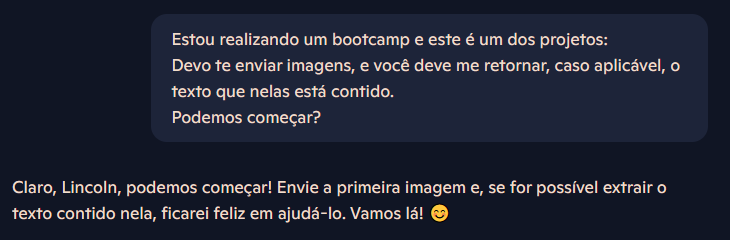
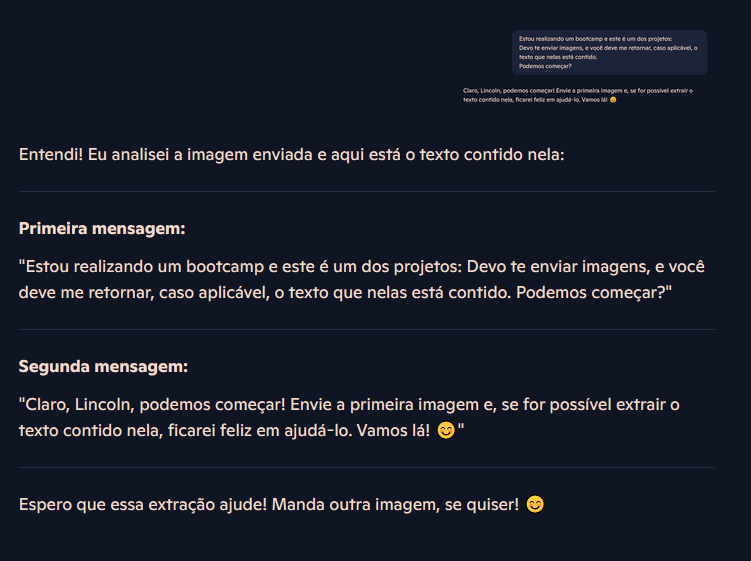
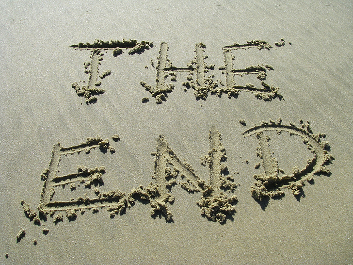
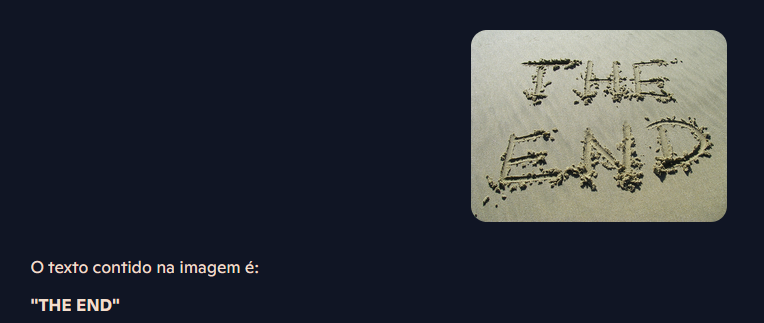

# GenerativeAI-Avanade2025

## 1. Introdução

Este projeto faz parte do bootcamp **DecolaTech** e tem como objetivo explorar técnicas de reconhecimento de texto em imagens utilizando o Copilot.

Neste repositório, documentei todo o processo, desde a escolha das imagens até a extração e análise dos textos reconhecidos. Além disso, compartilho aprendizados e insights adquiridos ao longo do desenvolvimento.

### Estrutura do Repositório

📂 **inputs/** – Contém as imagens utilizadas para o reconhecimento de texto.  
📂 **output/** – Armazena os resultados gerados após o processamento das imagens.  
📄 **README.md** – Documentação do projeto.

### Objetivos do Projeto

- Utilizar o Copilot para extrair texto de imagens;
- Armazenar e organizar os dados extraídos;
- Analisar a qualidade e precisão do reconhecimento;

Nos próximos tópicos, descrevo o processo detalhado e as descobertas feitas ao longo do desenvolvimento.

## 2. Imagens escolhidas

### 1. Recursão

Escolhi meu próprio prompt para a IA como imagem de input:

Neste caso, procurei testar a habilidade básica de reconhecer texto da IA. A imagem não possui nuances que possam vir a dificultar a visualização de texto, então é um começo perfeito para esse experimento.

#### Resposta

A IA teve sucesso no primeiro teste. A imagem é simples e plana o suficiente para que haja contraste entre o fundo e o texto.

### 2. Thank you for shopping local

A segunda imagem é um pouco diferente:

Ainda exite contraste entre plano de fundo e texto, mas o texto é de uma fonte pouco convencional. Desejo ver como a IA se sai neste cenário.

#### Resposta

Novamente, a fonte incomum não foi suficiente para impedir o reconhecimento do texto. Tenho um último experimento em mente.

### 3. Escritas na areia

Esta imagem possui pouco contraste entre fundo e texto em relação às anteriores. Ademais, os pequenos montes de areia presentes em todo o texto funcionam como artefatos, podendo vir a dificultar o reconhecimento.

#### Resposta

Surpreendentemente, a IA obteve sucesso em todos os três experimentos realizados. Os artefatos de areia não foram suficiente para impedir a leitura, e tampouco foi a fonte. IAs são ferramentas incrivelmente poderosas e podem poupar muito trabalho manual, quando usadas da forma correta.